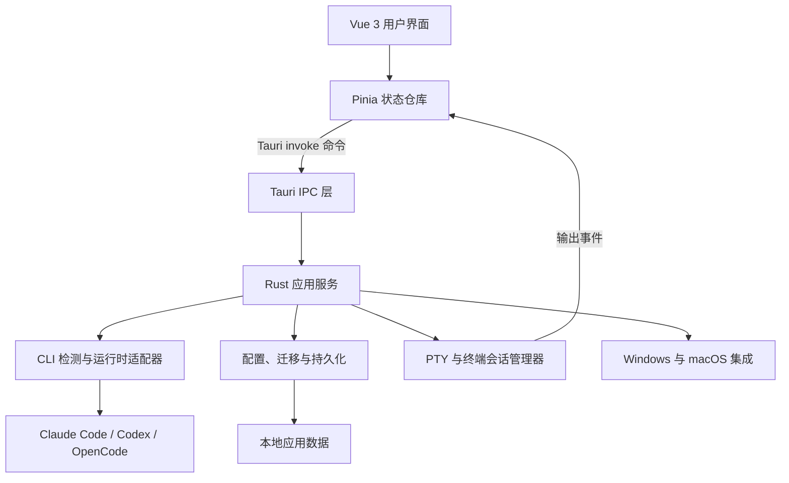

# Agents Launcher

[English](./README.md) | 简体中文

Agents Launcher 是一款统一运行和管理 **Claude Code**、**Codex** 与 **OpenCode** 的桌面工作区。它将相互隔离的 CLI 配置方案、项目与原生会话发现、内嵌 PTY 终端和文件工具集中在一个应用中。

应用使用 **Tauri 2**、**Vue 3**、**Pinia**、**TypeScript** 和 **Rust** 构建，基于操作系统原生 WebView 与 Rust PTY 后端运行，不需要捆绑 Electron 运行时。

## 平台状态

| 平台 | 状态 | 安装包 |
| --- | --- | --- |
| Windows 10/11 | 主要开发与发布平台 | NSIS `.exe` 安装包 |
| macOS 13+ | 桌面能力与打包流程已经验证；原生构建和发布检查在 Mac 上完成 | `.app` 与 `.dmg` |
| Linux | 暂不支持 | — |

macOS 能力已经验证并合入 `main`。后续 macOS 开发会在平台分支中先合并最新 `main`，再实现和验证平台改动，最后回合主干。由于需要额外的同步步骤，macOS 更新可能会比主线开发稍晚。

部分集成具有平台差异。Windows 会按需使用注册表、DPAPI 和 `winget`；macOS 使用平台专属配置文件与命令发现机制，不会提供仅适用于 Windows 的安装操作。

## 主要功能

| 功能区域 | 能力 |
| --- | --- |
| CLI 工作区 | 为 Claude Code、Codex 和 OpenCode 提供独立入口、隔离配置、运行时检测与能力检查 |
| 配置管理 | 创建、编辑、选择和应用各 CLI 的配置方案，发现模型并管理服务商设置 |
| 项目与会话 | 发现最近项目和 CLI 原生会话，创建项目会话并恢复历史工作 |
| 终端工作区 | 通过 xterm.js 和 `portable-pty` 在独立终端及项目终端中运行多标签 CLI 进程 |
| 下侧终端栏 | 在用户主目录或最近更新的最多五个项目目录打开独立终端标签；全部关闭后自动收起 |
| 工作区工具 | 浏览和编辑文件、移动工具侧边栏、调整面板尺寸并保存工作区状态 |
| 顶栏自定义 | 调整顶层入口顺序并隐藏可选 CLI 入口；配置入口始终保留 |
| 依赖门禁 | 在 Windows 和 macOS 启动时检查 Node.js 与 Git，再在激活 CLI 工作流前检查对应可执行程序；自动安装仅支持 Windows |
| 安全持久化 | 使用原子写入、校验备份、迁移、敏感信息脱敏和平台化凭据存储 |

## 支持的 CLI 集成

### Claude Code

- 基于环境变量的配置方案
- 模型发现与启动选项
- 激活工作区前执行 CLI 能力检查
- 共用项目工作区、原生会话列表与恢复支持

### Codex

- 托管配置方案与模型选择
- 激活工作区前执行 CLI 能力检查
- 从 Codex 会话元数据发现项目
- 原生线程列表与恢复支持

### OpenCode

- 托管服务商与模型配置
- 与现有 OpenCode 设置进行 JSONC 感知同步
- 服务商连接管理与本地凭据处理
- 原生项目和会话发现

Agents Launcher 不会捆绑这些 CLI。测试或使用某个工作区前，需要单独安装对应 CLI。

## 架构



前端负责展示和临时界面状态。Pinia 仓库协调项目、终端、运行时、配置方案和布局状态；需要权限的文件系统、进程、PTY、凭据与平台操作则由 Rust 通过 Tauri 命令完成。

### 前端

Vue 应用位于 `src/`：

- `components/config/` 提供共用配置工作区。
- `components/claude/`、`components/codex/` 和 `components/opencode/` 包含各 CLI 专属界面。
- `components/project/` 实现项目会话、文件工具和侧边栏。
- `components/terminal/` 管理 xterm.js 标签和 PTY 交互。
- `stores/` 保存 CLI 运行时、配置方案、项目、终端、顶栏布局和标签通信状态。

### 后端

Rust 应用位于 `src-tauri/src/`：

| 模块 | 职责 |
| --- | --- |
| `cli_contract`、`cli_capabilities`、`cli_runtime` | 共用 CLI 类型、能力验证、可执行程序检测与原生会话发现 |
| `codex_config`、`opencode_config`、`config_store` | 各 CLI 配置方案与配置管理 |
| `cli_migration`、`file_transaction` | 向后兼容迁移、原子写入、备份与恢复 |
| `project_manager`、`session_manager` | 项目元数据、最近项目与会话持久化 |
| `pty` | 进程创建、终端输入输出、尺寸调整、标题与生命周期管理 |
| `tab_cli` | 跨标签页命令、权限与终端快照 |
| `persistent_state`、`settings_manager` | 窗口、面板、字体、配置方案、布局与启动状态持久化 |
| `platform_env`、`env_applier`、`registry` | 平台化可执行程序发现与环境集成 |

## 数据与安全

应用管理的数据存放在：

| 平台 | 目录 |
| --- | --- |
| Windows | `%APPDATA%\ClaudeEnvManager\` |
| macOS | `~/Library/Application Support/ClaudeEnvManager/` |

应用更新所支持的外部配置文件时会保留未知字段，并对敏感状态变更使用事务写入。在 Windows 上，受管理的 Codex 与 OpenCode 密钥会在支持时使用 DPAPI。当前 macOS 实现使用应用私有文件而不是 Keychain，因此本地应用数据应被视为敏感信息。

不要提交 CLI 凭据、API Key、本地应用数据或生成的诊断文件。

## 开发

### 环境要求

- Git
- Node.js 22 或更高版本，建议使用仍受支持的 LTS 版本
- npm
- Rust stable 与 Cargo
- Tauri 平台依赖：
  - Windows：Microsoft C++ Build Tools、“使用 C++ 的桌面开发”工作负载、WebView2 和 Rust MSVC 工具链
  - macOS：Xcode Command Line Tools 和本机架构的 Rust 工具链

版本化打包流程需要 Python 3.10+，普通的 `npm run tauri dev` 开发不需要 Python。

完整安装方式与验证命令请参阅英文文档 [Development Environment Dependencies](./docs/development-environment-dependencies.md)。

### 安装项目依赖

```text
npm install
```

### 启动开发环境

```text
npm run tauri dev
```

该命令会启动 Vite 前端和支持热更新的 Tauri 应用。

### 静态检查与测试

```text
# 前端类型检查与生产构建
npm run build

# 前端终端测试（需要 Node.js 22+）
node --test tests/codexTerminalInput.test.ts tests/codexTerminalOutput.test.ts

# Rust 编译检查与单元测试
cargo check --manifest-path src-tauri/Cargo.toml
cargo test --manifest-path src-tauri/Cargo.toml

# 版本管理测试
python -m unittest discover -s tests -p test_build_version.py -v
```

macOS 如有需要，请将 Python 命令中的 `python` 改为 `python3`。

## 构建与发布

不使用版本状态管理时，可执行普通生产构建：

```text
npm run tauri build
```

使用版本化打包流程时：

```powershell
# Windows
python build.py
```

```bash
# macOS
./build-macos.command
```

Windows 和 macOS 的结果会分别记录在 `version.json` 中。只有所有必需平台都通过本地安装包测试后，当前版本才具备发布条件。完整流程、产物路径、Git Tag 和 GitHub Release 命令请参阅 [构建与发布说明](./docs/build.md)。

## 仓库结构

```text
.
|-- src/                    Vue 3 前端
|   |-- components/         配置、项目、终端与共用界面
|   |-- composables/        共用 Vue 行为
|   |-- stores/             Pinia 应用状态
|   |-- types/              TypeScript 类型契约
|   `-- utils/              前端安全与终端工具
|-- src-tauri/              Tauri 与 Rust 后端
|   |-- src/                命令、服务、持久化与 PTY 实现
|   |-- tests/fixtures/     CLI 契约与迁移测试数据
|   `-- capabilities/       Tauri 权限能力
|-- contracts/              共用 CLI 契约测试数据
|-- tests/                  前端与版本管理测试
|-- docs/                   稳定的开发与发布文档
|-- build.py                跨平台版本化打包工具
|-- build-macos.command     macOS 打包入口
|-- version.json            分平台发布状态
`-- dev.py                  开发启动辅助工具
```

## 快捷键

| 快捷键 | 操作 |
| --- | --- |
| `Shift + Enter` | 在内嵌 CLI 终端中换行 |
| `Ctrl + T` | 创建项目会话 |
| `Ctrl + Tab` | 切换 Claude Code 工作区的项目会话（当前仅 Claude Code 可用） |
| `Ctrl + P` | 在 Claude Code 项目侧边栏中打开文件（当前仅 Claude Code 可用） |
| `Ctrl + S` | 保存当前侧边栏文件 |
| `Ctrl + Shift + B` | 切换项目工具侧边栏 |

## 文档

- [开发环境依赖说明（英文）](./docs/development-environment-dependencies.md)
- [构建与发布说明](./docs/build.md)
