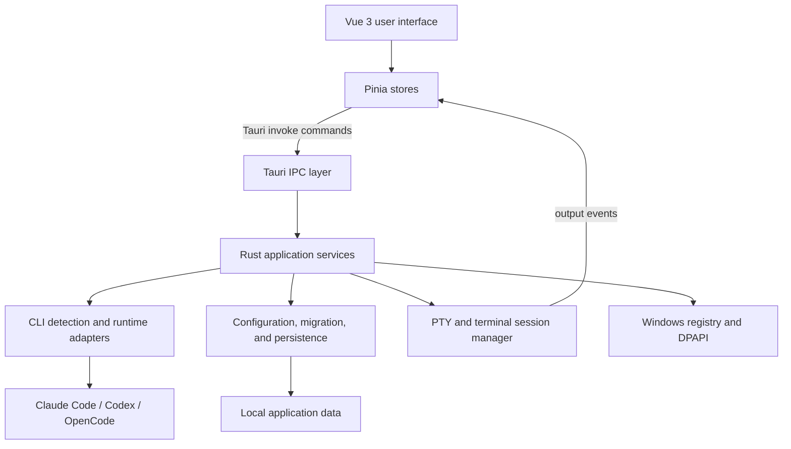

# CC Launcher

CC Launcher is a Windows desktop workspace for running and managing AI coding CLIs from one application. It provides dedicated integrations for **Claude Code**, **Codex**, and **OpenCode**, together with project-aware sessions, configuration profiles, an embedded terminal, and local orchestration tools.

The application is built with **Tauri 2**, **Vue 3**, and **Rust**. It uses the native Windows webview and a Rust PTY backend instead of bundling an Electron runtime.

> **Platform:** Windows 10/11 only. The backend uses Windows-specific registry and credential APIs.

## What It Does

| Area | Capabilities |
| --- | --- |
| CLI workspaces | Separate entry points for Claude Code, Codex, and OpenCode with runtime and capability detection |
| Configuration | Create, edit, select, and apply CLI-specific profiles; discover models and manage provider settings |
| Projects and sessions | Discover recent projects and native CLI sessions, create workspace sessions, and resume previous work |
| Embedded terminal | Run CLI processes in multi-tab PTY terminals powered by xterm.js and `portable-pty` |
| Workspace tools | Browse and edit files, manage side panels, resize panes, and preserve workspace state |
| Multi-agent workflows | Exchange messages between terminal tabs, control tab permissions, save snapshots, and manage orchestration presets |
| Safe persistence | Use atomic writes, verified backups, migrations, secret redaction, and Windows DPAPI where supported |

## Supported CLI Integrations

### Claude Code

- Environment-based configuration profiles
- Model discovery and launch options
- Recent project and session discovery
- Built-in or external terminal launch

### Codex

- Managed profile configuration and model selection
- CLI capability checks before workspace activation
- Project discovery from Codex session metadata
- Native thread listing and resume support

### OpenCode

- Managed provider and model configuration
- JSONC-aware synchronization with existing OpenCode settings
- Provider connection management and encrypted local credentials
- Native project and session discovery

## Architecture



The frontend owns presentation and transient UI state. Pinia stores coordinate project, terminal, runtime, and profile state, while all privileged filesystem, process, PTY, registry, and credential operations are handled by Rust through Tauri commands.

### Frontend

The Vue application lives under `src/`:

- `components/config/` provides the shared configuration workspace.
- `components/claude/`, `components/codex/`, and `components/opencode/` contain CLI-specific configuration interfaces.
- `components/project/` implements the project and session workspace.
- `components/terminal/` manages xterm.js tabs and PTY interaction.
- `components/orchestration/` provides agent roles and reusable orchestration presets.
- `stores/` contains Pinia stores for CLI runtimes, profiles, projects, terminals, and tab communication.

### Backend

The Rust application lives under `src-tauri/src/`. Its main responsibilities are grouped as follows:

| Modules | Responsibility |
| --- | --- |
| `cli_contract`, `cli_capabilities`, `cli_runtime` | Shared CLI types, capability validation, executable detection, and native session discovery |
| `codex_config`, `opencode_config`, `config_store` | CLI-specific profile and configuration management |
| `cli_migration`, `file_transaction` | Backward-compatible migrations, atomic writes, backups, and recovery |
| `project_manager`, `session_manager` | Project metadata, recent items, and session persistence |
| `pty` | Process creation, terminal input/output, resizing, titles, and lifecycle management |
| `tab_cli` | Inter-tab commands, permissions, terminal snapshots, and orchestration presets |
| `persistent_state`, `settings_manager` | Window, pane, font, active profile, and launch preference persistence |
| `registry`, `claude_launcher`, `model_fetcher` | Windows integration, CLI launch, environment application, and model API access |

## Data and Security

Application-managed state is stored under:

```text
%APPDATA%\ClaudeEnvManager\
```

The application preserves unknown fields when updating supported configuration files and uses transactional writes for sensitive state changes. Codex and OpenCode managed secrets use Windows DPAPI where applicable, and diagnostics are designed to redact credential values.

CC Launcher also reads native metadata and configuration from the installed CLIs. It does not bundle Claude Code, Codex, or OpenCode; each CLI must be installed separately for its workspace to become available.

## Development

### Prerequisites

- Windows 10 or Windows 11
- Node.js 20 or newer
- npm
- Rust stable with the `x86_64-pc-windows-msvc` target
- Visual Studio Build Tools with the Desktop development with C++ workload
- Microsoft Edge WebView2 Runtime

### Install Dependencies

```powershell
npm install
```

### Run in Development

```powershell
npm run tauri dev
```

This starts the Vite frontend and the Tauri application with hot reload.

### Build

```powershell
npm run tauri build
```

Production executables and the NSIS installer are generated under `src-tauri/target/release/`.

### Static Checks and Tests

```powershell
# Frontend type check and production bundle
npm run build

# Frontend terminal-output tests (Node.js 22+)
node --test tests/codexTerminalOutput.test.ts

# Rust compile check and unit tests
Set-Location src-tauri
cargo check
cargo test
```

## Repository Layout

```text
.
|-- src/                    Vue 3 frontend
|   |-- components/         Configuration, project, terminal, and orchestration UI
|   |-- composables/        Shared Vue behaviors
|   |-- stores/             Pinia application state
|   |-- types/              TypeScript contracts
|   `-- utils/              Frontend security and terminal helpers
|-- src-tauri/              Tauri and Rust backend
|   |-- src/                Commands, services, persistence, and PTY implementation
|   |-- tests/fixtures/     CLI contract and migration fixtures
|   `-- capabilities/       Tauri permission capabilities
|-- contracts/              Shared CLI contract fixtures
|-- tests/                  Frontend tests
|-- docs/                   Design, migration, and verification notes
|-- build.py                Windows release build helper
`-- dev.py                  Windows development launcher helper
```

## Keyboard Shortcuts

| Shortcut | Action |
| --- | --- |
| `Ctrl + T` | Create a project session |
| `Ctrl + W` | Close the active project session or terminal tab |
| `Ctrl + Tab` | Switch between project sessions or terminal tabs |
| `Ctrl + P` | Open a file in the project sidebar |
| `Ctrl + S` | Save the active sidebar file |
| `Ctrl + Shift + B` | Toggle the project tool sidebar |
