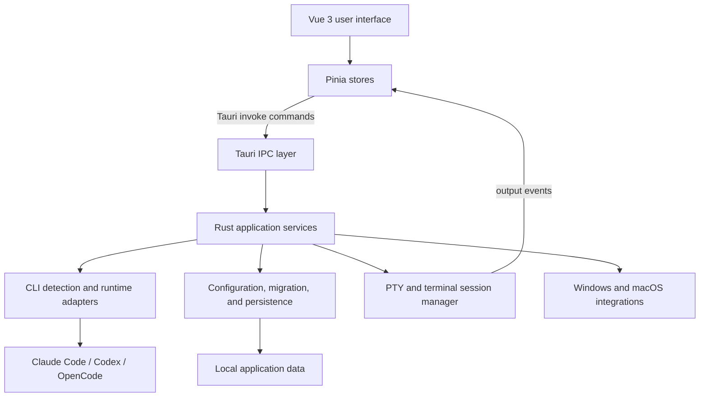

# Agents Launcher

English | [简体中文](./README-中文版.md)

Agents Launcher is a desktop workspace for running and managing **Claude Code**, **Codex**, and **OpenCode** from one application. It combines isolated CLI configuration profiles, project and native-session discovery, embedded PTY terminals, and file tools.

The application is built with **Tauri 2**, **Vue 3**, **Pinia**, **TypeScript**, and **Rust**. It uses the operating system's native webview and a Rust PTY backend instead of bundling an Electron runtime.

## Platform status

| Platform | Status | Packages |
| --- | --- | --- |
| Windows 10/11 | Primary development and release target | NSIS `.exe` installer |
| macOS 13+ | Desktop capabilities and packaging have been validated; native builds and release checks run on a Mac | `.app` and `.dmg` |
| Linux | Not currently supported | — |

macOS support has been validated and merged into `main`. Future macOS development uses a platform branch that first merges the latest `main`, then implements and validates platform changes before merging back. Because of this synchronization step, macOS updates may follow mainline development with a short delay.

Some integrations are platform-specific. Windows uses the registry, DPAPI, and `winget` where applicable. macOS uses platform-specific configuration files and command discovery; Windows-only installation actions are not exposed there.

## Features

| Area | Capabilities |
| --- | --- |
| CLI workspaces | Separate entry points for Claude Code, Codex, and OpenCode with isolated profiles, runtime detection, and capability checks |
| Configuration | Create, edit, select, and apply CLI-specific profiles; discover models and manage provider settings |
| Projects and sessions | Discover recent projects and native CLI sessions, create project sessions, and resume previous work |
| Terminal workspace | Run CLI processes in standalone and project-aware multi-tab PTY terminals powered by xterm.js and `portable-pty` |
| Bottom terminal sidebar | Open independent terminal tabs at the user home directory or one of the five most recently updated project roots; the panel collapses when all tabs close |
| Workspace tools | Browse and edit files, move the tool sidebar, resize panes, and preserve workspace state |
| Header customization | Reorder top-level entries and hide optional CLI entries; the configuration entry always remains available |
| Dependency gates | Validate Node.js and Git at startup on Windows and macOS, then check supported CLI executables before activating their workflows; automatic installation is Windows-only |
| Safe persistence | Use atomic writes, verified backups, migrations, secret redaction, and platform-aware credential storage |

## Supported CLI integrations

### Claude Code

- Environment-based configuration profiles
- Model discovery and launch options
- CLI capability checks before workspace activation
- Shared project workspaces with native session listing and resume support

### Codex

- Managed profile configuration and model selection
- CLI capability checks before workspace activation
- Project discovery from Codex session metadata
- Native thread listing and resume support

### OpenCode

- Managed provider and model configuration
- JSONC-aware synchronization with existing OpenCode settings
- Provider connection management and local credential handling
- Native project and session discovery

Agents Launcher does not bundle these CLIs. Install each CLI separately before testing or using its workspace.

## Architecture



The frontend owns presentation and transient UI state. Pinia stores coordinate project, terminal, runtime, profile, and layout state. Privileged filesystem, process, PTY, credential, and platform operations are handled by Rust through Tauri commands.

### Frontend

The Vue application lives under `src/`:

- `components/config/` provides the shared configuration workspace.
- `components/claude/`, `components/codex/`, and `components/opencode/` contain CLI-specific interfaces.
- `components/project/` implements project sessions, file tools, and sidebars.
- `components/terminal/` manages xterm.js tabs and PTY interaction.
- `stores/` contains Pinia state for CLI runtimes, profiles, projects, terminals, top-bar layout, and tab communication.

### Backend

The Rust application lives under `src-tauri/src/`:

| Modules | Responsibility |
| --- | --- |
| `cli_contract`, `cli_capabilities`, `cli_runtime` | Shared CLI types, capability validation, executable detection, and native session discovery |
| `codex_config`, `opencode_config`, `config_store` | CLI-specific profile and configuration management |
| `cli_migration`, `file_transaction` | Backward-compatible migrations, atomic writes, backups, and recovery |
| `project_manager`, `session_manager` | Project metadata, recent items, and session persistence |
| `pty` | Process creation, terminal input/output, resizing, titles, and lifecycle management |
| `tab_cli` | Inter-tab commands, permissions, and terminal snapshots |
| `persistent_state`, `settings_manager` | Window, pane, font, profile, layout, and launch-state persistence |
| `platform_env`, `env_applier`, `registry` | Platform-aware executable discovery and environment integration |

## Data and security

Application-managed state is stored under:

| Platform | Directory |
| --- | --- |
| Windows | `%APPDATA%\ClaudeEnvManager\` |
| macOS | `~/Library/Application Support/ClaudeEnvManager/` |

The application preserves unknown fields when updating supported external configuration files and uses transactional writes for sensitive state changes. On Windows, managed Codex and OpenCode secrets use DPAPI where supported. The current macOS implementation uses application-private files rather than Keychain protection, so local application data must be treated as sensitive.

Never commit CLI credentials, API keys, local application data, or generated diagnostic files.

## Development

### Prerequisites

- Git
- Node.js 22 or newer; use an active LTS release
- npm
- Rust stable and Cargo
- Platform requirements for Tauri:
  - Windows: Microsoft C++ Build Tools, the Desktop development with C++ workload, WebView2, and the Rust MSVC toolchain
  - macOS: Xcode Command Line Tools and the native Rust toolchain

Python 3.10+ is required for the versioned packaging workflow, but not for normal `npm run tauri dev` development.

See [Development Environment Dependencies](./docs/development-environment-dependencies.md) for installation details and verification commands.

### Install dependencies

```text
npm install
```

### Run in development

```text
npm run tauri dev
```

This starts the Vite frontend and the Tauri application with hot reload.

### Static checks and tests

```text
# Frontend type check and production bundle
npm run build

# Frontend terminal tests (Node.js 22+)
node --test tests/codexTerminalInput.test.ts tests/codexTerminalOutput.test.ts

# Rust compile check and unit tests
cargo check --manifest-path src-tauri/Cargo.toml
cargo test --manifest-path src-tauri/Cargo.toml

# Version-management tests
python -m unittest discover -s tests -p test_build_version.py -v
```

Use `python3` instead of `python` on macOS when necessary.

## Build and release

For a local production build without version-state handling:

```text
npm run tauri build
```

For the versioned packaging workflow:

```powershell
# Windows
python build.py
```

```bash
# macOS
./build-macos.command
```

Windows and macOS results are recorded separately in `version.json`. A version becomes publishable only after every required platform has passed its local package test. See the [Build and Release Guide](./docs/build.md) for the complete workflow, artifact locations, Git tags, and GitHub Release commands.

## Repository layout

```text
.
|-- src/                    Vue 3 frontend
|   |-- components/         Configuration, project, terminal, and shared UI
|   |-- composables/        Shared Vue behaviors
|   |-- stores/             Pinia application state
|   |-- types/              TypeScript contracts
|   `-- utils/              Frontend security and terminal helpers
|-- src-tauri/              Tauri and Rust backend
|   |-- src/                Commands, services, persistence, and PTY implementation
|   |-- tests/fixtures/     CLI contract and migration fixtures
|   `-- capabilities/       Tauri permission capabilities
|-- contracts/              Shared CLI contract fixtures
|-- tests/                  Frontend and version-management tests
|-- docs/                   Stable development and release documentation
|-- build.py                Cross-platform versioned packaging helper
|-- build-macos.command     macOS packaging entry point
|-- version.json            Per-platform release state
`-- dev.py                  Development launcher helper
```

## Keyboard shortcuts

| Shortcut | Action |
| --- | --- |
| `Shift + Enter` | Insert a new line in an embedded CLI terminal |
| `Ctrl + T` | Create a project session |
| `Ctrl + Tab` | Switch project sessions in the Claude Code workspace (currently Claude Code only) |
| `Ctrl + P` | Open a file in the Claude Code project sidebar (currently Claude Code only) |
| `Ctrl + S` | Save the active sidebar file |
| `Ctrl + Shift + B` | Toggle the project tool sidebar |

## Documentation

- [Development Environment Dependencies](./docs/development-environment-dependencies.md)
- [Build and Release Guide](./docs/build.md)
